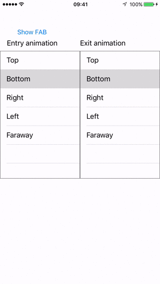

# VFloatingButton

VFloatingButton is the Android's equivalent for 'Floating Action Button' (FAB).  
As a plus, this floating button could be positioned in any position.



**Available positions:**

- topLeft 
- topRight
- topCenter
- center 
- centerLeft 
- centerRight
- bottomLeft 
- bottomRight
- bottomCenter 

If you don't want any of these position, you can set manually property **'idlePosition'**.

The VFloatingButton position is **BottomRight** by default and this position if always fixed.

VFloatingButton behaviour is highly customizable: for instance you can attach FAB to a generic UIScrollView (so, for instance, to a table view too) and specify the animation for entry/exit on screen.

**Available animation versus:**

- none 
- top 
- bottom
- right 
- left 
- faraway 


## Installation
 
Configure your podfile adding this line:

```ruby
pod 'VFloatingButton'
```   
     
Then run 'pod install'.

## Usage

VFloatingButton usage is very simple.  
After pod installation, you need to import FAB in file where you want to use it.

#### Code samples

For instance, if you want to add FloatingButton in a generic view controller, you can add this code on 'viewDidLoad':

```swift
var properties = VFloatingButtonProperties()
     
properties.viewButtonBackgroundColor = .black
properties.verticalMargin = 30.0
properties.horizontalMargin = 20.0
        
properties.idlePosition = .bottomCenter 
        
let button = VFloatingButton(frameContainer: self.view.frame, properties: properties)
button.delegate = self
button.showBordersShadow(shadowOffset: 0.1)
   
self.view.addSubview(button)    
```

All the floating button customizations are available on struct `VFloatingButtonProperties`.

## Requirements

There aren’t any requirements per se. Again, remember to add

```swift
import VFloatingButton
```

## License

VFloatingButton is published under the MIT license.
